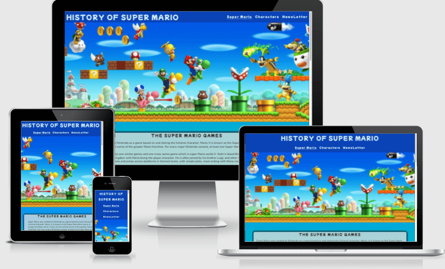

# History of Super Mario
## Introduction 
History of Super Mario is a site for looking back at the iconic characters, games and consoles related to the Super Mario franchise. This site is targeted towards the many members of the Nintendo Super Mario Bros fanbase, and can also be used by new fans for reference of the top 5 iconic charaters, and the release dates of the main Super Mario games and Nintendo consoles throughout the years.

Link to site

(https://harriss1989.github.io/History-of-SuperMario/)

## User Experience (UX)
* User stories
* Visitor Goals
    * When visiting this site, I want to be able to navigate easily, to find any content I may wish to explore.

    * When visiting this site, I want to be able to easily find out about the games and the storys surrounding them in the Super Mario Bros franchise.

    * When visiting this site, I want to be able to find out the information and abilities of the main characters across most of the games.

    * When visiting this site, I want the option to be kept up to date with any information regarding the franchise, or any changes to the website.

# Structure
The site consists of three main pages, Super Mario, Characters, Newsletter and a hidden thank you page when all user detail are entered into the form and submited.
# Design

The site design evolved over time from the origanal plans, feed back from user input made me re-think the layout as there was alot of information on one page. After thinking from a users perspective I decided to redisign the site just focusing on Super Mario and the main five character's. The site consists of a main informtion page with a breif history of Super Mario, a list of the main titles from the franchise and on which consloe it was released for. The second page consists of a character bio, giving a description of the main five characters and there abilities thorought the series. The third page is a sign up to newsletter, once details are added it brings the user to a hidden thank you page.

## Google Fonts:
Google fonts were used to import the "Mochiy Pop One" and  "Nunito" font into the style.css file which is used on all pages throughout the project. 
## Font Awesome:
Font Awesome was used on all pages throughout the website to add icons for social media links in the footer

# Colour Scheme
### Background Color Scheme

### Colors used for elements in site

## Balsamiq:
Balsamiq was used to create the wireframes during the design process. The wirefarmes do not match the final deployed site, after user feedback on early development of the site I decided to to change the layout to make it more user friendly. I removed the hisory of Nintendo and changed it to a charater bio page for the main five characters. I believe this makes for a more streamline version of the site keeping content to a minimum for a happier user experience.

Home Page Wireframe - [View](/assets/wireframes/main-page.png)

Mobile Wireframe - [View](/assets/wireframes/main-page-mobile.png)

Sign up page Wireframe - [View](/assets/wireframes/sign-up-page.png)

Thank you page Wireframe - [View](/assets/wireframes/thankyou.png)
## Features

Heading 
* The logo is used throught the site, I used "Mochiy Pop One" as this caught my eye as a very Mario style font, the blue and white color scheme is traditionaly relatable to Super Mario colors, contrast was low so I changed to a darker backkground color and a lighter font color. 

Navigation
* Navigation Menu, this features on all pages of the site. The position and style is consisitant throught the three pages. A hover element is implamented and once the user clicks on desired page, a visual que of a red bottom border shows the user they have clicked on the right page. I used a solid bottom border to represent what page the user is currently on. The font used was the same as the heading keeping it cosistant with the theme of the site.

Footer
* The Footer has social media links and a copyright for Nintendo, they are consistant on all pages, I added the social media links for extra resorses for the user, all of the links take the user to a Super Mario inspired page.

Super Mario Main page
* The main page of the site has a hero image Which I use across two of the three pages keeping it familier to the user. The page also consists of two text fields, the first gives a breif history of where the games started to how they evolved through out the years, whilst the seconed is a time-line list from the first titel in the series to current day. It also states which console thos titel were relised for.

Characters Page
* The character page has five indvidual boxes with a little background information, and a list of there strengths and abilities that they are known for through out the Super Mario Bros series. This is a page viewers can come to learn more about the iconic characters.

Sign Up Page
* The sign up page has a sign up box for users to input their information to subscribe for the monthly Super Mario Bros newsletter which is sent out via email. As this is my first project the input does not record any personal information. The newsletter is intended to inform the subscriber of any news and events associated with Super Mario. Once a user inputs their information and hits the 'Here we go' button, they will then be taken to a thank you for signing up page. No news letter will actually be sent out as this is for project perposes only.

## Technologies Used

* HTML5
* CSS3

Photos source
 * https://www.vecteezy.com/
 * https://www.istockphoto.com/
 * https://www.pinterest.co.uk/

 To save on file space I ran all photos through https://tinypng.com/
 

## Git
Git was used for version control by utilizing the Gitpod terminal, to commit to Git and Push to GitHub.
## GitHub:
GitHub is used to store the projects code after being pushed from Git.

## Testing
The W3C Markup Validator and W3C CSS Validator Services were used to validate every page of the project to ensure there were no syntax errors in the project.
add validater repot for other pages
addlighthouse reports desktop and mobile
add wave.web aim report 
W3C Markup Validator - [Results] index.html(https://validator.w3.org/nu/?showsource=yes&doc=https%3A%2F%2Fharriss1989.github.io%2FHistory-of-SuperMario%2Findex.html)
W3C Markup Validator - [Results]()
W3C CSS Validator - [Results](https://jigsaw.w3.org/css-validator/validator?uri=https%3A%2F%2Fharriss1989.github.io%2FHistory-of-SuperMario%2F&profile=css3svg&usermedium=all&warning=1&vextwarning=&lang=en)

list what browser and devices iv tested on
checked like works other tabs worked 